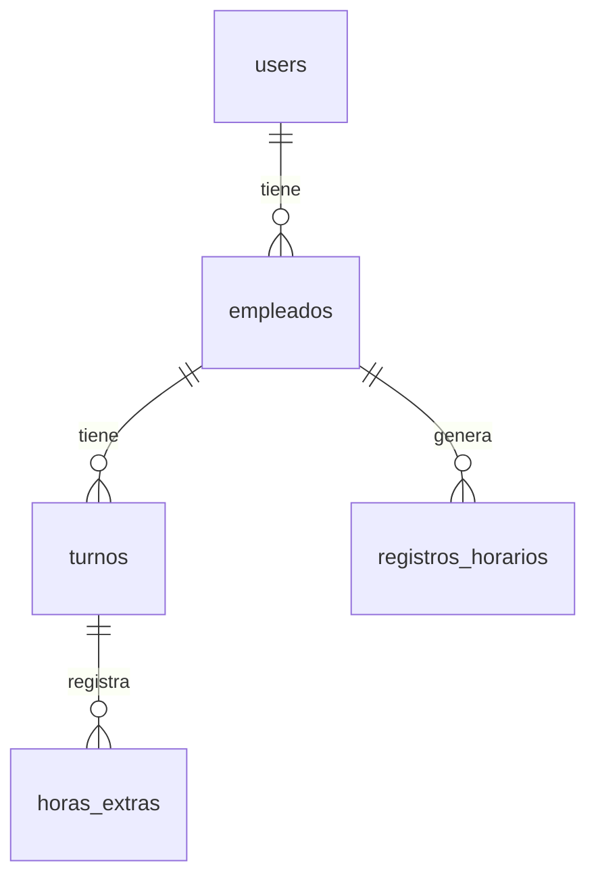

# Estructura de la Base de Datos

## Diagrama de Entidad-Relación



## Descripción de Tablas

### 1. users

Almacena la información de autenticación de los usuarios del sistema.

**Campos:**

- `id`: Identificador único (BIGINT UNSIGNED, PK, AUTO_INCREMENT)
- `name`: Nombre completo (VARCHAR(255), NOT NULL)
- `email`: Correo electrónico (VARCHAR(255), UNIQUE, NOT NULL)
- `password`: Contraseña encriptada (VARCHAR(255), NOT NULL)
- `email_verified_at`: Fecha de verificación (TIMESTAMP, NULLABLE)
- `remember_token`: Token para "recordar sesión" (VARCHAR(100), NULLABLE)
- `created_at`, `updated_at`: Auditoría (TIMESTAMP, NULLABLE)

### 2. empleados

Contiene la información de los empleados.

**Campos:**

- `id`: Identificador único (BIGINT UNSIGNED, PK, AUTO_INCREMENT)
- `identificacion`: Número de identificación (VARCHAR(255), UNIQUE, NOT NULL)
- `nombre`: Nombre (VARCHAR(255), NOT NULL)
- `apellido`: Apellido (VARCHAR(255), NOT NULL)
- `cargo`: Puesto de trabajo (VARCHAR(255), NULLABLE)
- `email`: Correo electrónico (VARCHAR(255), UNIQUE, NULLABLE)
- `telefono`: Teléfono de contacto (VARCHAR(255), NULLABLE)
- `direccion`: Dirección de residencia (TEXT, NULLABLE)
- `fecha_ingreso`: Fecha de ingreso a la empresa (DATE, NULLABLE)
- `estado`: Estado del empleado (VARCHAR(255), DEFAULT 'activo')
- `turno_id`: Referencia al turno asignado (BIGINT UNSIGNED, FK, NULLABLE)
- `salario`: Salario base mensual (DECIMAL(10,2), DEFAULT 0)
- `horasxsemana`: Horas laborales por semana (INT, DEFAULT 44)
- `created_at`, `updated_at`: Auditoría (TIMESTAMP, NULLABLE)

### 3. turnos

Registra los turnos laborales de los empleados.

**Campos:**

- `id`: Identificador único (BIGINT UNSIGNED, PK, AUTO_INCREMENT)
- `empleado_id`: Referencia al empleado (BIGINT UNSIGNED, FK, NOT NULL)
- `fecha`: Fecha del turno (DATE, NOT NULL)
- `hora_inicial`: Hora de inicio (TIME, NOT NULL)
- `hora_final`: Hora de fin (TIME, NOT NULL)
- `festivo`: Indicador de día festivo (TINYINT(1), DEFAULT 0)
- `created_at`, `updated_at`: Auditoría (TIMESTAMP, NULLABLE)

### 4. horas_extras

Controla las horas extras trabajadas.

**Campos:**

- `id`: Identificador único (BIGINT UNSIGNED, PK, AUTO_INCREMENT)
- `turno_id`: Referencia al turno (BIGINT UNSIGNED, FK, NOT NULL)
- `tipo`: Tipo de hora extra (VARCHAR(255), NOT NULL)
- `horas`: Cantidad de horas (DECIMAL(8,2), NOT NULL)
- `rate_multiplier`: Multiplicador de tarifa (DECIMAL(8,2), NOT NULL)
- `valor_calculado`: Valor total calculado (DECIMAL(10,2), NOT NULL)
- `created_at`, `updated_at`: Auditoría (TIMESTAMP, NULLABLE)

### 5. registros_horarios

Registra la asistencia y tiempos trabajados.

**Campos:**

- `id`: Identificador único (BIGINT UNSIGNED, PK, AUTO_INCREMENT)
- `empleado_id`: Referencia al empleado (BIGINT UNSIGNED, FK, NOT NULL)
- `entrada`: Marca de tiempo de entrada (DATETIME, NOT NULL)
- `salida`: Marca de tiempo de salida (DATETIME, NULLABLE)
- `tiempo_total`: Tiempo total trabajado en minutos (INT, NULLABLE)
- `extrasordinarias`: Horas extras ordinarias (DECIMAL(8,2), DEFAULT 0.00)
- `nocturnasordinarias`: Horas nocturnas ordinarias (DECIMAL(8,2), DEFAULT 0.00)
- `extrasnocturnas`: Horas extras nocturnas (DECIMAL(8,2), DEFAULT 0.00)
- `estado`: Estado del registro (VARCHAR(255), NULLABLE)
- `novedad`: Observaciones (TEXT, NULLABLE)
- `created_at`, `updated_at`: Auditoría (TIMESTAMP, NULLABLE)

## Relaciones

### 1. users → empleados (1:1)

- Un usuario puede estar asociado a un empleado
- No todos los usuarios necesitan ser empleados
- Relación opcional para propósitos de autenticación/autorización

### 2. empleados → turnos (1:N)

- Un empleado puede tener múltiples turnos
- Eliminación en cascada: si se elimina un empleado, se eliminan sus turnos
- Índice en `empleado_id` para búsquedas rápidas

### 3. turnos → horas_extras (1:N)

- Un turno puede tener múltiples registros de horas extras
- Eliminación en cascada: si se elimina un turno, se eliminan sus horas extras
- Índice en `turno_id` para búsquedas rápidas

### 4. empleados → registros_horarios (1:N)

- Un empleado puede tener múltiples registros horarios
- Eliminación en cascada: si se elimina un empleado, se eliminan sus registros
- Índice en `empleado_id` para búsquedas rápidas

## Índices

### Índices Clave Primaria

Todas las tablas tienen un índice de clave primaria en `id`.

### Índices Únicos

- `users.email`
- `empleados.identificacion`

### Índices de Clave Foránea

- `turnos.empleado_id`
- `horas_extras.turno_id`
- `registros_horarios.empleado_id`

### Índices Adicionales (PostgreSQL)

```sql
CREATE INDEX idx_turnos_empleado_id ON turnos(empleado_id);
CREATE INDEX idx_horas_extras_turno_id ON horas_extras(turno_id);
CREATE INDEX idx_registros_horarios_empleado_id ON registros_horarios(empleado_id);
CREATE INDEX idx_registros_horarios_entrada ON registros_horarios(entrada);
CREATE INDEX idx_registros_horarios_salida ON registros_horarios(salida);
```

## Consideraciones de Diseño

1. **Integridad Referencial**
    - Todas las relaciones tienen restricciones de clave foránea
    - Eliminación en cascada para mantener la integridad
    - Valores por defecto apropiados para campos numéricos

2. **Rendimiento**
    - Índices en campos de búsqueda frecuente
    - Tipos de datos apropiados para cada campo
    - Campos NULLABLES solo cuando es necesario

3. **Auditoría**
    - Todas las tablas incluyen `created_at` y `updated_at`
    - Registro de cambios importante para trazabilidad

4. **Seguridad**
    - Contraseñas almacenadas con hash
    - Tokens de sesión seguros
    - Restricciones de unicidad donde corresponda

## Migraciones

El sistema utiliza migraciones de Laravel para gestionar los cambios en el esquema. Los archivos de migración se encuentran en `database/migrations/`.

## Modelos

Cada tabla tiene un modelo correspondiente en `app/Models/` que define las relaciones y la lógica de negocio asociada.
